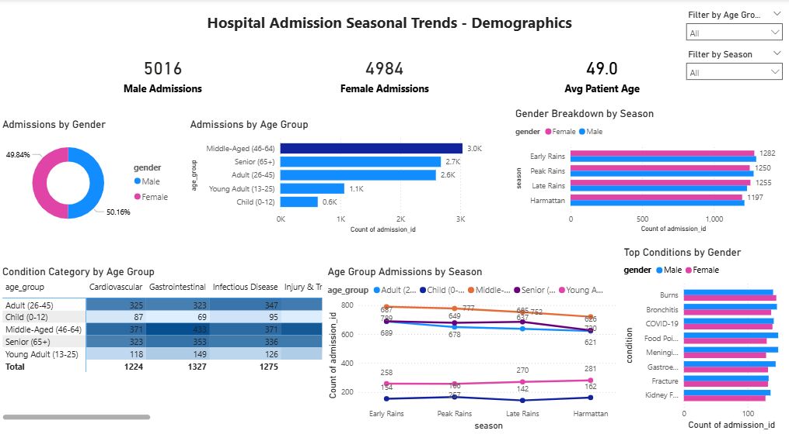

# 🏥 Hospital Admission Seasonal Trends Analysis

## Project Overview
An end-to-end data analysis project exploring hospital admission patterns across **10 Nigerian hospitals** from **2021 to 2023**. The project identifies seasonal admission trends, demographic patterns (age and gender), condition-level spikes, and regional burden distribution — with actionable recommendations for hospital resource planning, staffing, and public health preparedness.

---

## Tools & Technologies
| Tool | Purpose |
|---|---|
| **SQL** | Data exploration, cleaning, and 4-phase analysis |
| **Power BI** | Interactive 3-page dashboard and data visualization |

---

## Dataset
- **10,000 rows** of synthetic patient admission records modeled on Nigerian hospitals
- **18 columns** covering patient demographics, conditions, admission types, and hospital details
- **Zero nulls, zero duplicates** — clean and analysis-ready
- **3 years** of data: 2021, 2022, 2023
- **10 hospitals** across 3 regions — North, South, East
- **Nigeria-specific seasons:** Harmattan, Early Rains, Peak Rains, Late Rains
- **8 condition categories:** Respiratory, Cardiovascular, Gastrointestinal, Infectious Disease, Injury & Trauma, Maternal & Child, Mental Health, Urological
- **40 unique medical conditions** with realistic seasonal weighting


---

## SQL Analysis — 4 Phases

### Phase 1 — Data Exploration & Cleaning
- Row count validation, null checks, duplicate detection
- Date range and categorical column validation
- Summary statistics for age and length of stay
- Distribution by hospital, region, and year

### Phase 2 — Seasonal Trend Analysis
- Total admissions by season and month
- Year-over-year monthly trend (2021–2023)
- Top 10 conditions by total admissions nationally
- Condition category breakdown per season
- Top 5 conditions per season using window functions (RANK/PARTITION BY)
- Spike detection — conditions performing above their seasonal average
- Admissions by quarter and admission type
- Average length of stay by season and condition category

### Phase 3 — Demographic Analysis
- Gender split across all admissions
- Age group distribution and ranking
- Gender vs season cross-tabulation
- Age group vs season trend analysis
- Top conditions by gender using RANK/PARTITION BY
- Condition category mapped to age groups
- Average patient age per condition category
- Gender and age group combined breakdown with average length of stay

### Phase 4 — Hospital & Regional Analysis
- Total admissions by region and hospital
- Admissions by hospital and season
- Busiest season per hospital using RANK/PARTITION BY
- Top condition per hospital
- Average length of stay by hospital
- Regional condition category breakdown
- Year-over-year admissions per hospital (2021–2023)
- Emergency admissions by hospital and season
- National summary view (master query combining all dimensions)

---

## Key Findings

### Seasonal Trends
- **Peak Rains** is the busiest season overall, driven primarily by **Gastrointestinal** conditions — directly linked to flooding and contaminated water sources
- **April** is the single busiest month nationally (transition into Early Rains)
- **Gastroenteritis** spikes the most above its seasonal average — the strongest confirmed seasonal surge in the dataset
- **Mental Health** patients have the longest average length of stay at **17 days**, creating significant bed pressure despite moderate admission volume
- **Emergency admissions** are consistently distributed across all quarters — hospitals face emergency pressure year-round with no single seasonal relief window

### Demographics
- **Male patients** account for slightly higher admissions at **50.2%** vs Female at **49.8%**
- **Middle-Aged patients (46–64)** represent the largest admission group with **3,038 admissions** — reflecting the peak burden age for chronic conditions like hypertension and cardiovascular disease
- **Infectious Disease** hits **Children (0–12)** the hardest, with over **95 admissions** — a public health flag for young immune system vulnerability during rainy seasons
- **Mental Health** has the highest average patient age across all condition categories — older patients with mental health conditions require the longest care durations
- **Male Young Adults (13–25)** have an average length of stay of **11.2 days** — likely driven by trauma and injury cases in this risk-prone demographic

### Hospital & Regional
- **North region** carries the heaviest national burden with **4,072 admissions** — combined with Infectious Disease dominance, pointing to a public health infrastructure gap
- **Kaduna General Hospital** is the busiest facility nationally at **1,050 admissions**
- **Benin City Hospital** and **Kano State Hospital** share the highest average length of stay at **10.9 days** — indicating complex cases or discharge efficiency challenges
- **Jos University Teaching Hospital** shows consistent year-over-year growth: **306 (2021) → 324 (2022) → 350 (2023)** — the clearest burden growth trend in the dataset
- **Infectious Disease** is most prominent in the **North region** with **538 admissions**

---

## Power BI Dashboard — 3 Pages

### Page 1 — Seasonal Overview


Answers: *When do admissions spike and for which conditions?*
- KPI Cards: Total Admissions, Busiest Month, Avg Length of Stay
- Monthly Admission Trend (line chart — 3 years overlaid)
- Admissions by Season (bar chart)
- Top 10 Conditions by Admissions (horizontal bar)
- Admission Heatmap — Condition Category by Season (matrix with conditional formatting)
- Slicers: Year, Admission Type

### Page 2 — Demographics
Answers: *Who is being admitted — and does it vary by season?*
- KPI Cards: Male Admissions, Female Admissions, Avg Patient Age
- Admissions by Gender (donut chart)
- Admissions by Age Group (bar chart)
- Gender Breakdown by Season (clustered bar)
- Age Group Admissions by Season (line chart)
- Condition Category by Age Group (matrix heatmap)
- Top Conditions by Gender (clustered bar)
- Slicers: Age Group, Season

### Page 3 — Hospital & Regional View
Answers: *Which hospitals and regions carry the heaviest burden — and when?*
- KPI Cards: Total Hospitals, Busiest Hospital, Total Regions, Avg Length of Stay
- Admissions by Region (bar chart)
- Total Admissions by Hospital (bar chart — color coded by region)
- Hospital Admissions by Season (matrix heatmap)
- Hospital Admission Trend 2021–2023 (line chart)
- Avg Length of Stay by Hospital (bar chart)
- Condition Category by Region (stacked bar)
- Emergency Admissions by Region (bar chart)
- Slicers: Region, Year, Hospital

---

## Business Recommendations
1. **Increase Gastrointestinal resources during Peak Rains** — stock oral rehydration supplies, deploy additional gastroenterology staff from June–August
2. **Target Children with Infectious Disease prevention campaigns** before Early Rains — community health outreach in March/April
3. **Expand Mental Health bed capacity** — 17-day average LOS indicates a chronic shortage of long-term mental health facilities nationally
4. **Prioritise resource allocation to the North region** — highest admission volume and Infectious Disease burden requires urgent infrastructure investment
5. **Monitor Jos University Teaching Hospital** — consistent YoY growth signals a facility approaching capacity limits by 2024–2025
6. **Implement year-round Emergency preparedness** — Emergency admissions show no seasonal dip, meaning hospitals cannot reduce emergency staffing in any quarter

---

## Project Structure
```
hospital-admission-seasonal-trends/
│
├── dataset/
│   └── hospital_admissions_dataset.csv
│
├── sql/
│   ├── phase1_exploration.sql
│   ├── phase2_seasonal_trends.sql
│   ├── phase3_demographics.sql
│   └── phase4_hospital_regional.sql
│
├── dashboard/
│   └── hospital_admissions_dashboard.pbix
│
└── README.md
```


## About This Project
This project was built as part of a structured data analytics portfolio targeting real-world business domains. It simulates an operational analytics use case for hospital administrators, public health officials, and healthcare policymakers in Nigeria.

**Author:** Weeks Imoabasi
**Domain:** Healthcare Analytics
**Skills Demonstrated:** SQL (window functions, CTEs, aggregations), Power BI (DAX measures, conditional formatting, slicers, drill-through), Data Storytelling, Business Recommendations
